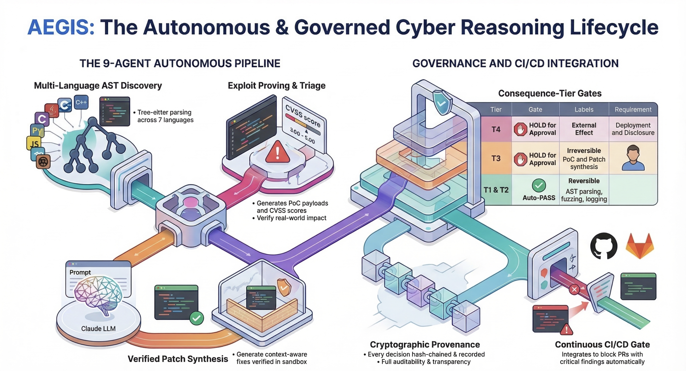

# AEGIS — Autonomous Equilateral Governed Intelligence System

A governed Cyber Reasoning System that discovers vulnerabilities across **14 languages**, synthesizes patches, and generates compliance evidence — all under consequence-tier governance with cryptographic provenance.

**Pareidolia LLC (d/b/a Raknor AI / Equilateral AI)**



## Highlights

- Single Rust binary (~33 MB), no runtime dependencies
- 115 detection patterns covering 126 CWE classes via tree-sitter AST parsing
- 110K+ LOC Rust, 1,802 passing tests
- 40 report formats, 60+ CLI flags
- 13 compliance frameworks mapped simultaneously
- Scans 1.4M LOC in 22 seconds (~65K LOC/s)
- Key-gated tiers: Community (free) / Pro / Premium / Enterprise

## Quick Start

Download the binary for your platform from [Releases](https://github.com/raknor-ai/aegis-releases/releases/latest), extract, and scan:

```bash
# macOS Apple Silicon
tar xzf aegis-cli-darwin-arm64.tar.gz
chmod +x aegis
./aegis scan ./your-project

# Linux x64
tar xzf aegis-cli-linux-x64.tar.gz
chmod +x aegis
./aegis scan ./your-project
```

## Available Platforms

| Platform | Asset |
|---|---|
| macOS Apple Silicon | `aegis-cli-darwin-arm64.tar.gz` |
| macOS Intel | `aegis-cli-darwin-x64.tar.gz` |
| Linux x64 | `aegis-cli-linux-x64.tar.gz` |
| Linux ARM64 | `aegis-cli-linux-arm64.tar.gz` |
| Windows x64 | `aegis-cli-win32-x64.zip` |

## Key Commands

```bash
# Reports
aegis scan <target> --all                    # All 40 report formats
aegis scan <target> --sarif --html           # Specific reports
aegis scan <target> --engineer               # Engineer-focused output

# Delta scanning
aegis scan <target> --changed-only           # Pre-commit hook (<1s)
aegis scan <target> --since origin/main      # CI delta scan

# CI gating
aegis scan <target> --fail-on critical       # Merge gate

# Compliance & certification
aegis scan <target> --evidence-bundle        # Full certification package
aegis scan <target> --due-diligence          # M&A technical DD report
aegis scan <target> --grc-summary            # GRC executive summary
```

## CI/CD

```yaml
# GitHub Actions
- name: Download AEGIS
  run: |
    curl -sL https://github.com/raknor-ai/aegis-releases/releases/latest/download/aegis-cli-linux-x64.tar.gz | tar xz
    chmod +x aegis
- name: AEGIS Security Scan
  run: ./aegis scan . --sarif --fail-on critical
```

## Verify Downloads

Each release includes a `SHA256SUMS` file:

```bash
sha256sum -c SHA256SUMS
```

## What Makes AEGIS Different

**Scanners find what's wrong. AEGIS understands what you built.**

Every SAST tool produces a finding list. AEGIS builds a **model of the program** first: whole-program call graph, inter-procedural taint analysis, entry point classification, and state machine extraction. From this model:

- **Compliance evidence from code** — Native OSCAL 1.1.2, DORA, ISO 27001, NIST CSF 2.0, VEX, SBOM. 13 frameworks mapped simultaneously from a single scan.
- **Three-tier reachability** — *External* (internet-facing) vs *internal* (ops scripts) vs *unreachable* (dead code). Context changes risk.
- **Class-M/J verification** — Findings classified as Mechanical (taint-flow confirmed) or Judgment (pattern-only). Compliance thresholds gate on Class-M only.
- **Architecture insights** — State machine extraction, bounded contexts, resource leaks, dependency accuracy, PII-in-logs detection.
- **Governed remediation** — Auto-patches under consequence tier governance with cryptographic provenance chains.

## Supported Languages

C, C++, Python, JavaScript, TypeScript, Java, Go, C#, Rust, HCL/Terraform, Bash, PHP, Kotlin, Swift

## Compliance Frameworks

NIST 800-53 | FedRAMP 20x | CMMC 2.0 | DoD SRG | ISO 27001:2022 | SOC 2 | OWASP Top 10 | PCI-DSS | HIPAA | EU DORA | EU AI Act | SEC/FINRA | AIUC-1

## Licensing

| Tier | What's Included |
|------|----------------|
| **Community** (free) | Real AST scan, first 50 findings (full count shown), SARIF + HTML + JSON, compliance readiness preview |
| **Pro** | Unlimited findings, auto-fix, patches, taint, tech debt, STRIDE, WAF rules, DAST |
| **Premium** | Pro + M&A due diligence, white-label branding, FedRAMP ConMon, governed transforms |
| **Enterprise** | Full stack: OSCAL, DORA, ISO, NIST CSF, VEX, SBOM, scoring, evidence bundles, IAM, IR playbooks |

```bash
# Activate a license key
aegis activate --key AEGIS-...

# Or set via environment variable
export AEGIS_LICENSE_KEY="AEGIS-..."
```

Key resolution: `--key` flag > `AEGIS_LICENSE_KEY` env var > `~/.raknor/license.json` > Community fallback.

## Documentation

See the [User Guide](USER-GUIDE.md) for the complete flag reference, tier comparison, and feature documentation.

---
*Pareidolia LLC (d/b/a Raknor AI / Equilateral AI) — [aegis.raknor.ai](https://aegis.raknor.ai)*
